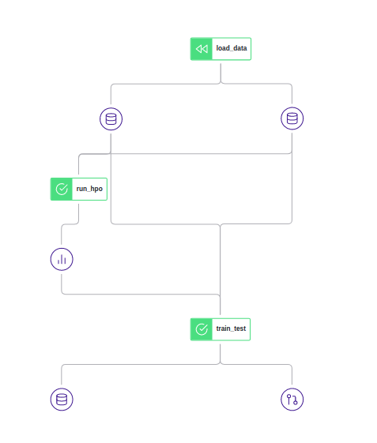

# ZenML + Optuna + PyTorch

A primitive example of how to use ZenML for Hyperparameter Tuning with [Optuna](https://github.com/optuna/optuna) and PyTorch.

The pipeline consist of 3 steps:
* Load the FashionMNIST data.
* Optimize hyperparameter with Optuna.
* Train and evaluate a model with the best hyperparameters.

Vizualization of the pipeline on the local ZenML Dashboard:

## Get Started
 
`pip install zenml[server] optuna optuna-dashboard plotly`

Run the `pytorch_hpo_fmnist.ipynb`.

To view the Optuna dashboard run `optuna-dashboard sqlite:///example.db`

